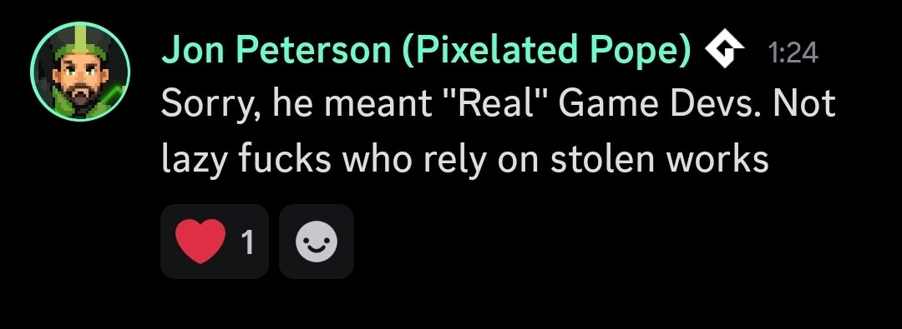

# GameMaker MCP Server

[](https://www.npmjs.com/package/gamemaker-mcp)
[](https://www.npmjs.com/package/gamemaker-mcp)
[](https://github.com/yearningss/gamemaker-mcp/blob/main/LICENSE)
[](https://github.com/yearningss/gamemaker-mcp)

A project-aware local MCP server for GameMaker Studio. It gives an MCP client structured access to a `.yyp` project: inspection, static analysis, guarded editing, object/room/shader operations, snapshots, validation, and official Igor builds.

The server uses the stable `@modelcontextprotocol/sdk` v1 line over `stdio`. It does not bind a network port. File operations stay inside one configured project, and existing text files use SHA-256 optimistic concurrency plus backups.

## Highlights

- 83 MCP tools, 10 reusable workflow prompts, and 6 project resources;
- zero-config workspace auto-detection (open any GameMaker project folder in your AI client);
- CLI installer & manager (`gamemaker-mcp install`, `doctor`, `connect`);
- tolerant parsing of GameMaker `.yyp`/`.yy` JSON-like files, including trailing commas;
- project, asset, room, object-event, object-inheritance, sprite, sound, sequence, font, tileset, animation curve, timeline, and shader inspection;
- GML symbol/complexity diagnostics, FPS profiler, i18n scanner, draw state auditor, health score (0-100%), object hierarchy tree, doc exporter, state machine visualizer, dead GML code detector, and duplicate code finder;
- preflight GML syntax validator (`gm_gml_validate_snippet`), Igor diagnostic compiler (`gm_project_compile_errors`), and Feather JSDoc generator (`gm_gml_docgen`);
- exact GML patch previews and guarded writes;
- GameMaker folder, object, script, shader, object-event, timeline, room-setting, room instance placement, and room-creation-code operations;
- integrity-checked project snapshots and guarded restoration;
- GML Finite State Machine, Particle System, GUI layout, and Inventory system boilerplate generators;
- synchronous compile plus persistent background Igor Compile/PackageZip jobs, status, wait, and cancellation;
- automatic GameMaker runtime and `Igor.exe` discovery;
- project-root path sandbox, symlink/junction checks, per-file limits, read-only mode, and build opt-in.

## Requirements

- Node.js 20 or newer;
- a GameMaker `.yyp` project;
- GameMaker Studio only for compile/package tools. Inspection and editing work without it.

## Installation & Setup Guide

### Method 1: Zero-Config Workspace Auto-Detect (Recommended)

Connect `gamemaker-mcp` once globally for all your AI clients:

```powershell
npx gamemaker-mcp@latest connect all
```

**How it works**:
Open any GameMaker project folder in **Claude Desktop**, **Google Antigravity**, **Cursor**, **Codex**, or **Qwen Code**. The server automatically discovers and connects to your `.yyp` project file in the workspace directory!

---

### Method 2: Automatic One-Line Setup with Explicit Project Path

Run the automated installer via `npx`, passing the path to your GameMaker `.yyp` project file or directory:

```powershell
npx gamemaker-mcp@latest install "C:\Path\To\YourGame\YourGame.yyp"
```

What this command does automatically:
1. Verifies **Node.js** version (requires Node 20+).
2. Auto-detects installed **GameMaker Studio runtimes** & `Igor.exe`.
3. Validates your GameMaker `.yyp` project structure.
4. Generates a local `mcp-config.json` in your project directory.
5. Automatically configures and connects **Claude Desktop**, **Google Antigravity**, **Cursor**, **Codex**, and **Qwen Code**.

---

### Method 3: Global CLI Installation

Install `gamemaker-mcp` globally using `npm`:

```powershell
npm install -g gamemaker-mcp
```

Then run commands from any terminal or PowerShell:

```powershell
# Full automatic setup for a project:
gamemaker-mcp install "C:\Projects\MyGame\MyGame.yyp"

# Verify environment, runtime, and client connection status:
gamemaker-mcp doctor "C:\Projects\MyGame\MyGame.yyp"

# Connect a specific AI client (claude | antigravity | cursor | codex | qwen | all):
gamemaker-mcp connect antigravity
gamemaker-mcp connect claude
gamemaker-mcp connect qwen
```

---

### Method 4: Manual Client Configuration

If you prefer adding the MCP server to your AI client's configuration file manually:

#### 1. Claude Desktop (`%APPDATA%\Claude\claude_desktop_config.json`)
```json
{
  "mcpServers": {
    "gamemaker": {
      "command": "npx",
      "args": ["-y", "gamemaker-mcp"],
      "env": {
        "GAMEMAKER_MCP_MODE": "workspace-write",
        "GAMEMAKER_MCP_ALLOW_BUILD": "1"
      }
    }
  }
}
```

#### 2. Google Antigravity (`~/.gemini/antigravity.json`)
```json
{
  "mcpServers": {
    "gamemaker": {
      "command": "npx",
      "args": ["-y", "gamemaker-mcp"],
      "env": {
        "GAMEMAKER_MCP_MODE": "workspace-write",
        "GAMEMAKER_MCP_ALLOW_BUILD": "1"
      }
    }
  }
}
```

#### 3. Cursor (`%APPDATA%\Cursor\User\globalStorage\mcp.json`)
```json
{
  "mcpServers": {
    "gamemaker": {
      "command": "npx",
      "args": ["-y", "gamemaker-mcp"],
      "env": {
        "GAMEMAKER_MCP_MODE": "workspace-write",
        "GAMEMAKER_MCP_ALLOW_BUILD": "1"
      }
    }
  }
}
```

#### 4. Qwen Code / CLI (`~/.qwen/mcp.json`)
```json
{
  "mcpServers": {
    "gamemaker": {
      "command": "npx",
      "args": ["-y", "gamemaker-mcp"],
      "env": {
        "GAMEMAKER_MCP_MODE": "workspace-write",
        "GAMEMAKER_MCP_ALLOW_BUILD": "1"
      }
    }
  }
}
```

## Environment variables

| Variable | Default | Meaning |
|---|---:|---|
| `GAMEMAKER_PROJECT` | auto-detect | Project directory or exact `.yyp` file (auto-detects from workspace if omitted) |
| `GAMEMAKER_MCP_MODE` | `read-only` | `read-only` or `workspace-write` |
| `GAMEMAKER_MCP_ALLOW_BUILD` | `0` | Enable Igor compile/package operations |
| `GAMEMAKER_MCP_MAX_FILE_BYTES` | `1048576` | Per-file text read/write limit |
| `GAMEMAKER_IGOR` | auto-detect | Exact path to `Igor.exe` |
| `GAMEMAKER_RUNTIME` | inferred | Runtime directory paired with Igor |
| `GAMEMAKER_USER_DIR` | auto-detect | GameMaker user/configuration directory |

## Complete Tool Catalog (83 Tools)

### Project & Navigation (10 Tools)

| Tool | Purpose |
|---|---|
| `gm_project_info` | Project identity, IDE/resource versions, asset counts, and room order |
| `gm_runtime_detect` | Installed runtimes and selected Igor toolchain |
| `gm_asset_list` | Filtered and paginated asset index |
| `gm_asset_read` | Asset metadata plus related GML/shader sources and hashes |
| `gm_file_list` | Filtered project file list with size/time and bounded hashing |
| `gm_file_read` | Allowed text content plus SHA-256 |
| `gm_code_search` | Literal or regex GML/GLSL search |
| `gm_project_validate` | Structural YYP/YY/resource/event/shader validation |
| `gm_project_statistics` | Resource, file, line, complexity, shader, and dependency statistics |
| `gm_project_autofix` | Scan and automatically repair missing YYP references, missing shader files, and corrupted metadata |

### Static Analysis & Quality Audit (16 Tools)

| Tool | Purpose |
|---|---|
| `gm_gml_analyze` | Functions, symbols, calls, complexity, delimiter errors, and risky patterns |
| `gm_shader_analyze` | Entry points, declarations, varying compatibility, and portability diagnostics |
| `gm_symbol_references` | Declarations, calls, writes, reads, and optional metadata references |
| `gm_dependency_graph` | Asset dependencies, evidence, isolated nodes, and cycles |
| `gm_unused_assets` | Scan project for unreferenced sprites, sounds, scripts, fonts, paths, and objects |
| `gm_gml_profile_check` | Scan Step/Draw events & loops for CPU/memory anti-patterns |
| `gm_i18n_scan` | Scan GML code for hardcoded string literals and suggest localization keys |
| `gm_draw_state_audit` | Audit Draw events for GPU state leaks (blendmodes, alpha, shader state) |
| `gm_gml_validate_snippet` | Preflight GML code for syntax delimiter balance and deprecated builtins |
| `gm_project_health_score` | Calculate 0-100% health score, grade (A+ to F), and recommendations |
| `gm_object_hierarchy` | Build object parent-child inheritance tree with inherited events |
| `gm_doc_export` | Generate structured Markdown documentation for all project assets |
| `gm_gml_duplicate_find` | Scan project GML files to detect identical contiguous code blocks across assets |
| `gm_macros_list` | Scan all scripts and objects to extract and list GML #macro definitions |
| `gm_state_machine_visualize` | Parse GML code to extract states and transitions, returning a Mermaid stateDiagram-v2 string |
| `gm_gml_dead_code_detect` | Scan GML scripts and objects to detect declared functions that are never called anywhere in the project |

### GML, Assets & Resources (22 Tools)

| Tool | Purpose |
|---|---|
| `gm_gml_patch_preview` | Exact replacement count and changed-line preview without writing |
| `gm_gml_patch` | Exact guarded replacement with expected match count |
| `gm_gml_write` | Atomic guarded GML write |
| `gm_gml_docgen` | Generate Feather-compliant JSDoc headers (`/// @function`, `/// @param`, `/// @returns`) |
| `gm_sprite_inspect` | Inspect sprite origin (X/Y), collision mask mode, frames, speed, and texture group |
| `gm_sprite_create` | Create a new GameMaker Sprite asset (`.yy`) with configurable dimensions, origin, and texture group |
| `gm_sound_inspect` | Inspect sound audio group, compression type, sample rate, bit depth/rate, duration, and volume |
| `gm_sound_create` | Create a new GameMaker Sound asset (`.yy`) linking sound audio files with compression and volume |
| `gm_font_create` | Create a new GameMaker Font asset (`.yy` metadata) with font size, bold, and italic parameters |
| `gm_font_inspect` | Inspect a GameMaker Font asset and return font size, name, bold/italic options |
| `gm_tileset_create` | Create a new GameMaker Tile Set asset (`.yy` metadata) linked to an existing Sprite |
| `gm_tileset_inspect` | Inspect a GameMaker Tile Set asset and return tile size, border, and linked sprite |
| `gm_folder_create` | Create or repair an asset-browser folder/YPP entry |
| `gm_script_create` | Create script metadata and GML source |
| `gm_state_machine_generate` | Generate a clean, struct-based GML Finite State Machine controller script (`scr_state_machine`) |
| `gm_particle_system_generate` | Generate a professional, struct-based GML Particle System manager boilerplate script |
| `gm_gui_layout_generate` | Generate a responsive GML GUI layout manager script and register it |
| `gm_inventory_system_generate` | Generate a struct-based GML Inventory system manager script and register it |
| `gm_asset_rename` | Safely rename any asset on disk, in YYP/YY metadata, and refactor all GML references project-wide |
| `gm_note_create` | Create a new GameMaker Note asset (`notes/NoteName/NoteName.txt`) with documentation text |
| `gm_note_inspect` | Read text documentation content, line count, file paths, and SHA-256 hash of a Note asset |
| `gm_note_update` | Guardedly update text content of a GameMaker Note asset with SHA-256 concurrency check |

### Objects & Events (9 Tools)

| Tool | Purpose |
|---|---|
| `gm_object_create` | Create a modern GMObject and YYP reference |
| `gm_object_configure` | Set flags and sprite/mask/parent references |
| `gm_object_events` | List events with stable keys, paths, hashes, and line counts |
| `gm_object_event_read` | Read a common named event |
| `gm_object_event_read_raw` | Read any event by type/number/optional collision object |
| `gm_object_event_upsert` | Add or replace a common named event |
| `gm_object_event_remove` | Remove a common named event; code deletion is opt-in |
| `gm_object_event_remove_raw` | Precisely remove any numeric/collision event |
| `gm_object_event_chain` | Traverse parent hierarchy of an object and return implementing event files, line counts, and paths |

### Rooms, Shaders, Sequences, Timelines & Curves (13 Tools)

| Tool | Purpose |
|---|---|
| `gm_room_inspect` | Room settings, layers, instances, views, physics, and creation code |
| `gm_room_configure` | Guarded room size/persistence/view/volume update |
| `gm_room_creation_code_upsert` | Guarded room creation-code write/reference update |
| `gm_room_instance_add` | Place an object instance in a room at coordinates (X, Y) with scale, rotation, and layer selection |
| `gm_room_layer_add` | Add a new Instance, Background, Tilemap, or Asset layer to a room at specified depth and visibility |
| `gm_shader_create` | Create shader metadata plus vertex/fragment stages |
| `gm_shader_inspect` | Stage hashes, uniforms, attributes, varyings, and interface issues |
| `gm_shader_update` | Guarded per-stage source update with preflight of both hashes |
| `gm_sequence_inspect` | Inspect Sequence tracks, length, playback speed, and keyframes |
| `gm_timeline_create` | Create a new GameMaker Timeline asset (.yy metadata) with a list of step moments and GML moment scripts |
| `gm_timeline_inspect` | Inspect a GameMaker Timeline asset and return the list of defined moment step indexes and GML paths |
| `gm_anim_curve_create` | Create a new Animation Curve asset with default linear channels |
| `gm_anim_curve_inspect` | Inspect an Animation Curve asset and return defined animation channel names |

### Snapshots & Integrity (4 Tools)

| Tool | Purpose |
|---|---|
| `gm_snapshot_create` | Create an integrity manifest and text payload snapshot |
| `gm_snapshot_list` | List saved snapshots |
| `gm_snapshot_inspect` | Verify and compare a snapshot |
| `gm_snapshot_restore` | Restore recorded files with integrity checks and backups |

### Builds & Igor Compiler Jobs (8 Tools)

| Tool | Purpose |
|---|---|
| `gm_compile_sync` | Synchronous Windows VM compile through Igor.exe |
| `gm_project_compile_errors` | Compile project with Igor and return parsed, structured file/line/message syntax errors |
| `gm_job_compile_start` | Start persistent background Igor `compile` job |
| `gm_job_package_zip_start` | Start persistent background Igor `package-zip` job |
| `gm_job_status` | Read live/persisted job state and artifact information |
| `gm_job_wait` | Wait for terminal job state |
| `gm_job_cancel` | Terminate an active build job |
| `gm_job_list` | List persistent build job history |

### Client Configuration (1 Tool)

| Tool | Purpose |
|---|---|
| `gm_connection_config` | Inspect and generate stdio client configuration |

## Resources and Prompts

### Resources (6)

- `gamemaker://project/info` — Live project summary and resource metadata.
- `gamemaker://project/statistics` — Live resource, line count, complexity, and dependency stats.
- `gamemaker://runtimes` — Detected GameMaker Studio runtimes and Igor.exe paths.
- `gamemaker://gml/rules` — Mandatory GML 2024+ strict syntax and coding rules for AI model context.
- `gamemaker://snapshots` — List of recorded project integrity snapshots.
- `gamemaker://jobs/history` — History of Igor build and package jobs.

### Workflow Prompts (10)

- `create-state-machine`: Generate a robust, clean state machine pattern for GameMaker objects.
- `optimize-draw-events`: Audit and optimize Draw events for maximum FPS.
- `refactor-gml-script`: Clean up, modernize, and add Feather JSDoc headers to GML scripts.
- `add-object-event`: Step-by-step guidance for adding and configuring object events safely.
- `create-script`: Scaffold a new script with strict Feather JSDoc headers.
- `create-shader`: Scaffold a vertex/fragment GLSL ES shader pair.
- `inspect-room`: Detailed analysis of room settings, layers, and instances.
- `analyze-project`: Complete diagnostic review of project health and architecture.
- `create-snapshot`: Safety workflow before performing multi-file refactoring.
- `repair-project`: Diagnostic and repair guide for broken resource references.

## Recommended workflow

1. Inspect with `gm_project_info`, `gm_asset_list`, and the analysis tools.
2. Before a multi-file change, create a labeled snapshot.
3. Read every affected file and retain the returned SHA-256.
4. Preview exact GML patches where applicable.
5. Apply the smallest guarded edit. Stop and re-read if a hash is stale.
6. Run `gm_project_validate` after metadata changes.
7. Compile a trusted project with `gm_job_start`, then use `gm_job_wait` and `gm_job_log`.

Backups are stored under `.gamemaker-mcp/backups`; snapshots and job history live under `.gamemaker-mcp/snapshots` and `.gamemaker-mcp/jobs`.

## Test any project

The smoke command starts the built MCP server in read-only mode, lists its tools, and calls project info, validation, statistics, GML analysis, and shader analysis:

```powershell
npm run smoke -- "C:\path\to\Game.yyp"
```

## Security model

- tool file paths are project-relative; absolute paths, traversal, NUL bytes, and symlink/junction escapes are rejected;
- only an allowlist of text extensions can be written;
- writes and Igor operations are disabled by default;
- existing-file writes require a SHA-256 read by the caller unless an explicitly supported force path is used;
- metadata edits preserve unknown fields through `jsonc-parser` and create backups;
- Igor is launched from a fixed executable with allowlisted actions and `shell: false`;
- **only compile/package trusted GameMaker projects**: GameMaker itself can run project compiler batch files, extensions, and build hooks;
- stdout is reserved for MCP JSON-RPC; server diagnostics go to stderr.

The server intentionally does not expose arbitrary shell commands, arbitrary YY/YPP overwrite, bulk asset deletion, or GUI automation. Binary sprite/audio import remains outside the current safe text-focused scope.

## Special Thanks (Not Really)

A special shoutout to **Jon Peterson ([PixelatedPope](https://www.youtube.com/@PixelatedPope))** for his hostile comment regarding this tool and AI assistance in GameMaker development:

> "Sorry, he meant 'Real' Game Devs. Not lazy fucks who rely on stolen works"



### A Striking Irony in the GameMaker Community

It is deeply disappointing to see this kind of reaction from a prominent community educator whose content has helped many beginners get started with coding.

*   **The Mentorship Paradox:** The core mission of an educator is to lower the barrier to entry and make development accessible. AI-assisted tooling (like this MCP server) does exactly that—democratizing learning by offering a 24/7 interactive helper that explains GML concepts and catches errors.
*   **The Cycle of Gatekeeping:** Every major technology leap in game development has faced this defensive reaction. High-level language users were once called "lazy" by assembly developers; GameMaker users were ridiculed by custom-engine purists. Today, manual coders repeat history by gatekeeping AI tools.
*   **Evolution, Not Theft:** Claiming that AI tools rely on "stolen works" overlooks how learning works. Just as humans learn by observing patterns in code, libraries, and tutorials, LLMs learn syntax structure.

While some choose to throw insults and protect legacy gatekeeping, we will continue building modern, open-source, project-aware developer tooling to make GameMaker Studio and the new GMRT runtime more accessible, efficient, and powerful for everyone. 🚀

